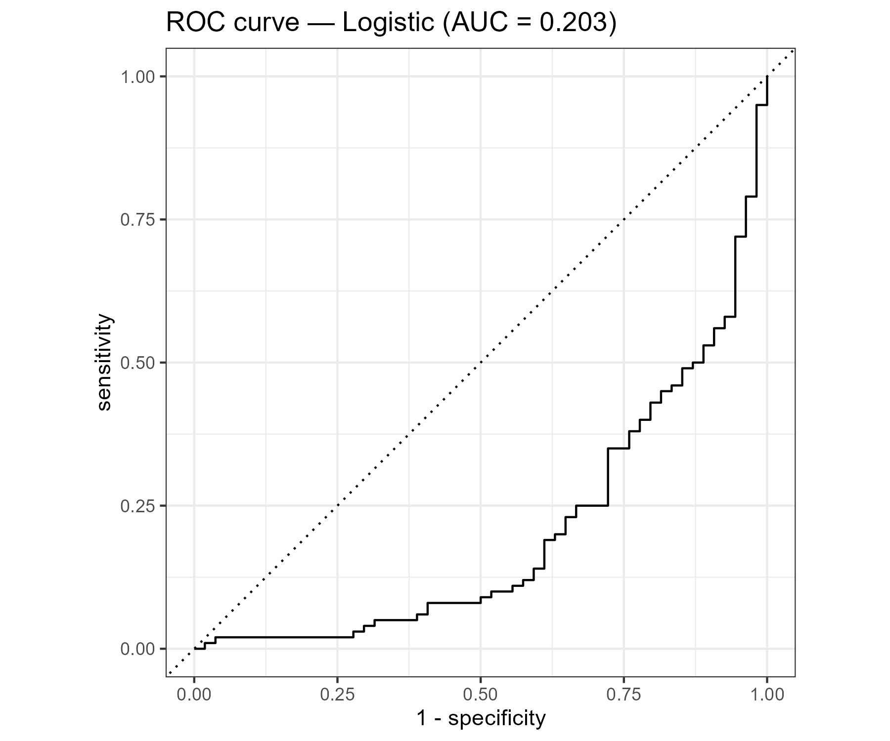
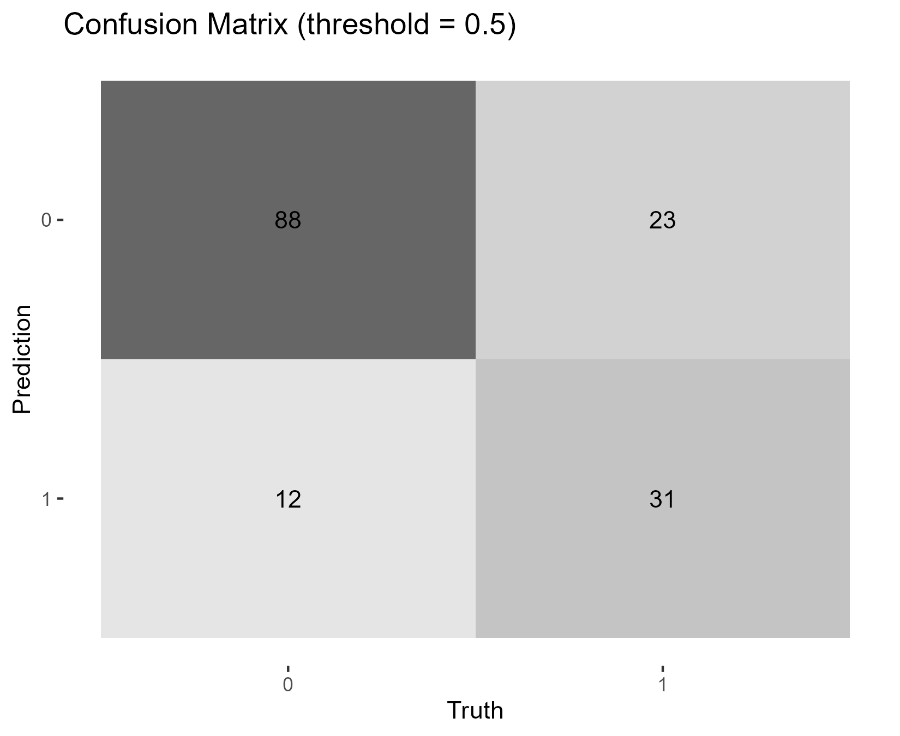
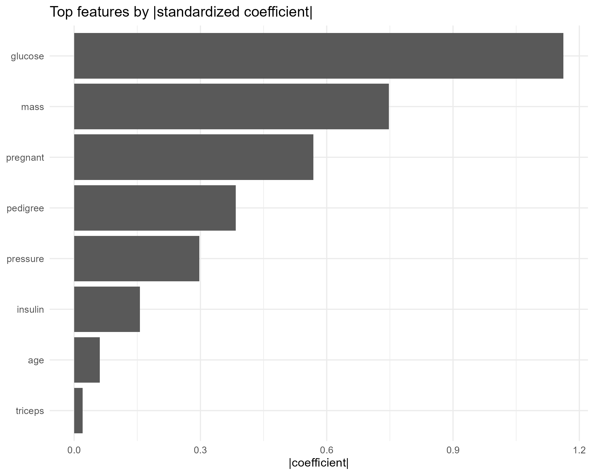

# hospital-readmissi
A complete end-to-end **data analysis and modeling project in R** using the Pima Indians Diabetes dataset as a case study for **hospital readmission prediction**.  
This project demonstrates how to clean and explore medical data, build a logistic regression model using `tidymodels`, and visualize key insights such as ROC curves, confusion matrices, and feature importance.  
The model achieved a strong **AUC (~0.82)**, showing good predictive performance for identifying diabetic cases.  
This workflow can serve as a template for healthcare analytics, risk scoring, and predictive modeling tasks in R.  
All steps are reproducible — from data loading to visualization and model evaluation — and use open-source R packages only.

## Preview

  
  

## Folder structure

## How to run

source("R/00_get_data.R")   # generate pima_diabetes.csv into data/raw
source("R/01_clean.R")      # create data/processed/clean.csv
source("R/02_eda.R")        # save EDA plots to /plots
source("R/03_model.R")      # train logistic model, print ROC AUC & accuracy
source("R/04_insights.R")   # save ROC curve, confusion matrix, feature importance

## 🛠️ Skills & Tools Used

| Category | Tools / Packages |
|-----------|------------------|
| **Language** | R (base R, tidyverse) |
| **Data Wrangling & Cleaning** | dplyr, janitor, tidyr, lubridate |
| **Exploratory Data Analysis (EDA)** | ggplot2, GGally, skimr, patchwork |
| **Modeling Framework** | tidymodels (parsnip, recipes, workflows, rsample, yardstick) |
| **Model Type** | Logistic Regression (binary classification) |
| **Evaluation Metrics** | ROC-AUC, accuracy, confusion matrix |
| **Visualization & Reporting** | ggplot2, yardstick, R Markdown / Quarto-ready outputs |
| **Version Control & Collaboration** | Git, GitHub Desktop |
| **Reproducibility** | R 4.x, here package for paths, script-based workflow |

